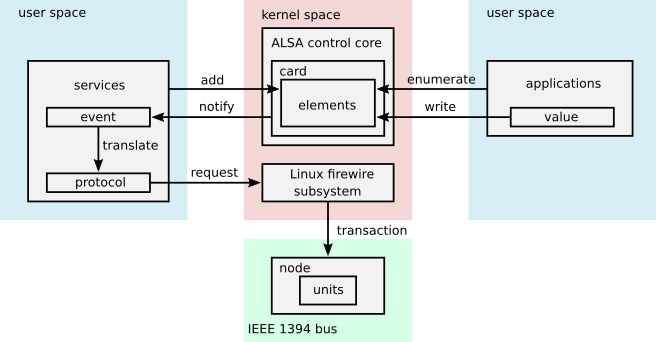
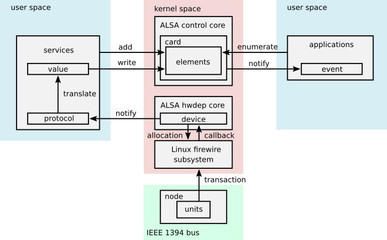
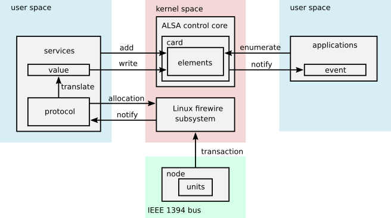
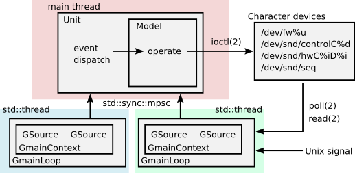

========================
snd-firewire-ctl-services
========================

2024/02/25
Takashi Sakamoto

Introduction
============

This project is a sub-project within Advanced Linux Sound Architecture a.k.a ALSA, aimed to provide
user space service programs for Audio and Music units connected to IEEE 1394 bus, supported by
drivers in ALSA firewire stack.

The latest release is
`version 0.2.0 <https://github.com/alsa-project/snd-firewire-ctl-services/releases/tag/snd-firewire-ctl-services%2Fv0.2.0>`_.

The service programs are designed to operate digital signal processing function in the audio and
music units connected to IEEE 1394 bus. The service programs work as
`message broker <https://en.wikipedia.org/wiki/Message_broker>`_. ALSA control and sequencer
applications are available as an end to communicate to the service programs. The audio and music
units in IEEE 1394 bus is the opposite end. The service programs receives messages from both
ends, then translates and convert the messages to send to the opposite end. The internal design of
the programs are illustrated in ``Design note`` section.

Executables for service programs
================================

The project provides the following service programs in the form of Rust binary crates:

snd-firewire-digi00x-ctl-service
   For sound card bound to ALSA firewire-digi00x driver (snd-firewire-digi00x)
snd-firewire-tascam-ctl-service
   For sound card bound to ALSA firewire-tascam driver (snd-firewire-tascam), or TASCAM FE-8.
snd-fireworks-ctl-service
   For sound card bound to ALSA fireworks driver (snd-fireworks)
snd-firewire-motu-ctl-service
   For sound card bound to ALSA firewire-motu driver (snd-firewire-motu)
snd-oxfw-ctl-service
   For sound card bound to ALSA oxfw driver (snd-oxfw)
snd-bebob-ctl-service
   For sound card bound to ALSA bebob driver (snd-bebob)
snd-dice-ctl-service
   For sound card bound to ALSA dice driver (snd-dice)
snd-fireface-ctl-service
   For sound card bound to ALSA fireface driver (snd-fireface)

Disclaimer
==========

The project provides neither GUI programs nor end-user interfaces against expectation of users,

The main motivation of project is to preserve the way (protocol) to operate the audio and music
units in IEEE 1394 bus, which was defined by several vendors.

Supported devices
=================

Currently below devices are supported. If you would like to add support for your device, please
contact to developer.

* snd-firewire-digi00x-ctl-service

  * Digi 002
  * Digi 002 Rack
  * Digi 003
  * Digi 003 Rack
  * Digi 003 Rack+

* snd-firewire-tascam-ctl-service

  * Tascam FW-1884
  * Tascam FW-1082
  * Tascam FW-1804
  * Tascam FE-8 (work without ALSA firewire-tascam driver)

* snd-fireworks-ctl-service

  * Mackie (Loud) Onyx 1200F
  * Mackie (Loud) Onyx 400F
  * Echo Audio Audiofire 12 (till Jul 2009)
  * Echo Audio Audiofire 8 (till Jul 2009)
  * Echo Audio Audiofire 12 (since Jul 2009)
  * Echo Audio Audiofire 8 (since Jul 2009)
  * Echo Audio Audiofire 2
  * Echo Audio Audiofire 4
  * Echo Audio Audiofire Pre8
  * Gibson Robot Interface Pack (RIP) for Robot Guitar series

* snd-firewire-motu-ctl-service

  * Version 1 models

    * MOTU 828
    * MOTU 896

  * Register DSP models

    * MOTU Traveler
    * MOTU 828mkII
    * MOTU 896HD
    * MOTU UltraLite
    * MOTU 8pre
    * MOTU 4pre
    * MOTU AudioExpress

  * Command DSP models

    * MOTU 828mk3 (FireWire only)
    * MOTU 828mk3 (Hybrid)
    * MOTU 896mk3 (FireWire only)
    * MOTU 896mk3 (Hybrid)
    * MOTU UltraLite mk3 (FireWire only)
    * MOTU UltraLite mk3 (Hybrid)
    * MOTU Traveler mk3
    * MOTU Track 16

* snd-oxfw-ctl-service

  * Tascam FireOne
  * Apogee Duet FireWire
  * Griffin FireWave
  * Lacie FireWire Speakers
  * Mackie Tapco Link.FireWire 4x6
  * For the others, common controls are available.

* snd-bebob-ctl-service

  * Apogee Ensemble
  * Behringer Firepower FCA610
  * Digidesign Mbox 2 Pro
  * Ego Systems Quatafire 610
  * Focusrite Saffire
  * Focusrite Saffire LE
  * Focusrite Saffire Pro 10 i/o
  * Focusrite Saffire Pro 26 i/o
  * Icon Firexon
  * M-Audio FireWire Solo
  * M-Audio FireWire Audiophile
  * M-Audio FireWire 410
  * M-Audio FireWire 1814
  * M-Audio Ozonic
  * M-Audio ProFire LightBridge
  * M-Audio ProjectMix I/O
  * PreSonus Firebox
  * PreSonus Firepod/FP10
  * PreSonus Inspire 1394
  * Roland Edirol FA-66
  * Roland Edirol FA-101
  * Stanton ScratchAmp in Final Scratch version 2
  * TerraTec Aureon 7.1 FW
  * TerraTec Phase 24 FW
  * TerraTec Phase X24 FW
  * TerraTec Phase 88 FW
  * Yamaha Go 44
  * Yamaha Go 46

* snd-dice-ctl-service

  * M-Audio ProFire 2626
  * M-Audio ProFire 610
  * Avid Mbox 3 Pro
  * TC Electronic Konnekt 24d
  * TC Electronic Konnekt 8
  * TC Electronic Studio Konnekt 48
  * TC Electronic Konnekt Live
  * TC Electronic Desktop Konnekt 6
  * TC Electronic Impact Twin
  * TC Electronic Digital Konnekt x32
  * Alesis MultiMix 8/12/16 FireWire
  * Alesis iO 14
  * Alesis iO 26
  * Alesis MasterControl
  * Lexicon I-ONIX FW810s
  * Focusrite Saffire Pro 40
  * Focusrite Liquid Saffire 56
  * Focusrite Saffire Pro 24
  * Focusrite Saffire Pro 24 DSP
  * Focusrite Saffire Pro 14
  * Focusrite Saffire Pro 26
  * PreSonus FireStudio
  * PreSonus FireStudio Project
  * PreSonus FireStudio Tube
  * PreSonus FireStudio Mobile
  * Weiss Engineering ADC2
  * Weiss Engineering Vesta
  * Weiss Engineering DAC2, Minerva
  * Weiss Engineering AFI1
  * Weiss Engineering INT202, INT203, DAC1 FireWire option card
  * Weiss Engineering DAC202, Maya
  * Weiss Engineering MAN301
  * For the others, common controls are available. If supported, control extension is also available.

* snd-fireface-ctl-service

  * Former models

    * Fireface 800
    * Fireface 400

  * Latter models

    * Fireface UCX
    * Fireface 802

Restrictions
============

Due to a lack of information about the target devices, certain restrictions are unavoidable.
However, we welcome any assistance that can enhance the project.

* snd-bebob-ctl-service

  * The most of compressor, equalizer, and reverb controls are not available for Focusrite Saffire.
  * No control is available for un-coded devices. For example, PrismSound Orpheus is the case.

* snd-fireworks-ctl-service

  * Some control is not available for Gibson Robot Interface Pack.

* snd-dice-ctl-service

  * The most of equalizer controls are not available for Focusrite Saffire Pro 24 DSP.
  * The most of monitor parameters may not work for Alesis iO 14/26 FireWire. This may come from
    firmware version.
  * The channel strip dynamics, equalizer, and reverb are not available for Lexicon I-ONIX 810s.
  * No control is available for Focusrite Saffire Pro 40 (TCD3070 ASIC).
  * No control is available for Solid State Logic Duende Classic and Mini.

* snd-firewire-digi00x-ctl-service

  * Due to hardware design, the function of DSP can not be configured unless an ALSA PCM
    application initiates isochronous communication.

* snd-firewire-tascam-ctl-service

  * Due to hardware design, most controls are not synchronized to hardware expectedly unless an
    ALSA PCM application initiates isochronous communication.
  * For console models, any event in control surface is available via port of ALSA Sequencer. The
    event is converted to controller event with channel 0 which has the consecutive number as param
    and event value. At present, the consecutive number is fixed and not configurable.

* snd-firewire-motu-ctl-service

  * For Command DSP models, the monitor functions (the talkback switch, the listenback switch, the
    talkback volume, the listenback volume, the channel focus, the return assignment) are not
    operable yet. (The developer completely forgot to implement them.)
  * Due to hardware design, most controls, including hardware metering, are not synchronized to
    hardware expectedly for Register DSP models unless an ALSA PCM application initiates isochronous
    communication.
  * Due to hardware design, hardware metering may not work properly for Command DSP models unless an
    ALSA PCM application initiates isochronous communication.
  * The channel positions available in the hardware meter is not adequate in all Command DSP
    models.
  * Sometimes, there may be an issue with initializing Command DSP models for communication. In such
    case, the workaround is to simply restart the service program.
  * Due to hardware quirk of Audio Express, asynchronous communication often fails with
    ``unsolicited response`` system message.
  * Due to asynchronous transaction failure (busy), for Command DSP models, the port assignments, the
    phone assignments, the configuration for word clock output, and the configuration of programmable
    level meter are not synchronized expectedly to any action in hardware surface.

* snd-fireface-ctl-service

  * The controls of latter models are not synchronized to any operation by the Remote Control or
    the Advanced Remote Control.

Support
=======

* If finding any issue, please file it to
  `github repository <https://github.com/alsa-project/snd-firewire-ctl-services>`_.

License
=======

* Some library crates are released under MIT license. They are available in `<crates.io>`_
  as well.

  * `alsa-ctl-tlv-codec <https://crates.io/crates/alsa-ctl-tlv-codec>`_
  * `ieee1212-config-rom <https://crates.io/crates/ieee1212-config-rom>`_
  * `ta1394-avc-general <https://crates.io/crates/ta1394-avc-general>`_
  * `ta1394-avc-audio <https://crates.io/crates/ta1394-avc-audio>`_
  * `ta1394-avc-stream-format <https://crates.io/crates/ta1394-avc-stream-format>`_
  * `ta1394-avc-ccm <https://crates.io/crates/ta1394-avc-ccm>`_

* Some library crates for protocol implementation are released under GNU Lesser General
  Public License v3.0 or later with respect to clause for reverse engineering. They are
  available in `<crates.io>`_ as well.

  * `firewire-bebob-protocols <https://crates.io/crates/firewire-bebob-protocols>`_
  * `firewire-fireworks-protocols <https://crates.io/crates/firewire-fireworks-protocols>`_
  * `firewire-oxfw-protocols <https://crates.io/crates/firewire-oxfw-protocols>`_
  * `firewire-dice-protocols <https://crates.io/crates/firewire-dice-protocols>`_
  * `firewire-digi00x-protocols <https://crates.io/crates/firewire-digi00x-protocols>`_
  * `firewire-tascam-protocols <https://crates.io/crates/firewire-tascam-protocols>`_
  * `firewire-motu-protocols <https://crates.io/crates/firewire-motu-protocols>`_
  * `firewire-fireface-protocols <https://crates.io/crates/firewire-fireface-protocols>`_

* The other crates are for runtime and released under GNU General Public License Version 3.

Dependencies
============

* Rust programming language <https://www.rust-lang.org/> v1.65 or later.
* Cargo
* glib `<https://developer.gnome.org/glib/>`_
* libhinawa v4.0 or later `<https://git.kernel.org/pub/scm/libs/ieee1394/libhinawa.git/>`_
* libhitaki v0.2 or later `<https://github.com/alsa-project/libhitaki>`_
* alsa-gobject v0.3 or later `<https://github.com/alsa-project/alsa-gobject/>`_

* The library crates enumerated in `License` section are downloaded from `<crates.io>`_ when
  building by configurations of `Cargo.toml`.

In Debian and its derived distributions such as Ubuntu
--------------------------------------------------------

In Debian 13.0 (trixie) or later, some packages are available instead of the manual installation
of dependent libraries.

* `libhinawa source package <https://tracker.debian.org/pkg/libhinawa>`_

  * `libhinawa4`
  * `libhinawa-dev`
  * `gir1.2-hinawa-4.0`

* `libhitaki source package <https://tracker.debian.org/pkg/libhitaki>`_

  * `libhitaki0`
  * `libhitaki-dev`
  * `gir1.2-hitaki-0.0`

In Ubuntu 24.04 LTS (Noble Numbat) or later, the packages are also available by Debian import
mechanism.

How to build
============

Build ::

    $ cargo build

Execute temporarily ::

    & cargo run --bin (the executable name) -- (the arguments of executable)

All of executables can print help when either ``--help`` or ``-h`` is given as an argument of
command line. In the most executables, the first positional argument is the numeric identifier of
sound card in Linux sound subsystem. For further information, please refer to ``Runtime debugging``
clause.

Once the service program runs, it remains to dispatch events until receiving SIGTERM signal (e.g.
press Ctrl + C) or detecting disconnection of the device.

Install executables ::

    $ cargo install --path (path to binary crate)

The runtime crates which provide the executables are listed below:

snd-firewire-digi00x-ctl-service
    ``snd-firewire-digi00x-ctl-service`` crate locates in ``runtime/digi00x``
snd-firewire-tascam-ctl-service
    ``snd-firewire-tascam-ctl-service`` crate locates in ``runtime/tascam``
snd-fireworks-ctl-service
    ``snd-fireworks-ctl-service`` crate locates in ``runtime/fireworks``
snd-firewire-motu-ctl-service
    ``snd-firewire-motu-ctl-service`` crate locates in ``runtime/motu``
snd-oxfw-ctl-service
    ``snd-oxfw-ctl-service`` crate locates in ``runtime/oxfw``
snd-bebob-ctl-service
    ``snd-bebob-ctl-service`` crate locates in ``runtime/bebob``
snd-dice-ctl-service
    ``snd-dice-ctl-service`` crate locates in ``runtime/dice``
snd-fireface-ctl-service
    ``snd-fireface-ctl-service`` crate locates in ``runtime/fireface``

The executable is usually installed under ``~/.cargo/bin``, while it's possible to choose the path.
In detail, please refer to
`manual of cargo install <https://doc.rust-lang.org/cargo/commands/cargo-install.html>`_.

Uninstall executables ::

    $ cargo uninstall -p (name of runtime crate)

Runtime debugging
=================

All executables support an option for log level for debugging. When either ``-l`` or
``--log-level`` is given with log level, they prints verbose logs to standard output.
At present, ``debug`` is just supported for the log level.

This function is implemented by `tracing <https://crates.io/crates/tracing>`_ and
`tracing-subscriber <https://crates.io/crates/tracing-subscriber>`_ crates.

Supported protocols
===================

* IEEE 1212:2001 - IEEE Standard for a Control and Status Registers (CSR) Architecture for Microcomputer Buses `<https://ieeexplore.ieee.org/servlet/opac?punumber=8030>`_
* Protocols defined by 1394 Trading Association `<https://web.archive.org/web/20210216003030/http://1394ta.org/specifications/>`_
   * Configuration ROM for AV/C Devices 1.0 (Dec. 2000, 1394 Trade Association)
   * AV/C Digital Interface Command Set General Specification Version 4.2 (September 1, 2004. TA Document 2004006)
   * Audio and Music Data Transmission Protocol 2.3 (April 24, 2012. Document 2009013)
   * AV/C Connection and Compatibility Management Specification 1.1 (March 19, 2003. TA Document 2002010)
   * AV/C Audio Subunit Specification 1.0 (October 24, 2000. TA Document 1999008)
   * AV/C Stream Format Information Specification 1.0 (May 24, 2002, TA Document 2001002)
   * AV/C Stream Format Information Specification 1.1 rev.5 (April 15, 2005. TA Document 2004008)
* Vendor specific protocols
   * Protocol for Digi 002/003 family of Digidesign
   * Protocol for FireWire series of TASCAM (TEAC)
   * Protocol for Fireworks board module of Echo Digital Audio
   * Protocol for Mark of the Unicorn (MOTU) FireWire series
   * Protocol for Oxford Semiconductor OXFW970/OXFW971 ASIC
   * Protocol for DM1000/DM1100/DM1500 ASIC in BridgeCo. Enhanced BreakOut Box (BeBoB)
   * Protocol for DiceII ASIC in Digital Interface Communication Engine (DICE)
   * Protocol extension for TCD2210/TCD2220 ASIC in Digital Interface Communication Engine (DICE)
   * Protocol for former models of Fireface series of RME GmbH
   * Protocol for latter models of Fireface series of RME GmbH

Design note
===========

Control model
-------------

Measure model
-------------

Notify model (with help of drivers in ALSA firewire stack)
-------------------------------------------------------------------

Notify model (without any help of drivers in ALSA firewire stack)
-------------------------------------------------------------------

Multi threading
---------------

