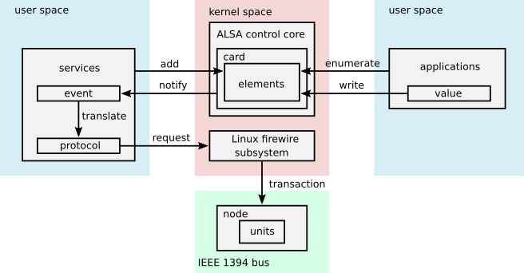
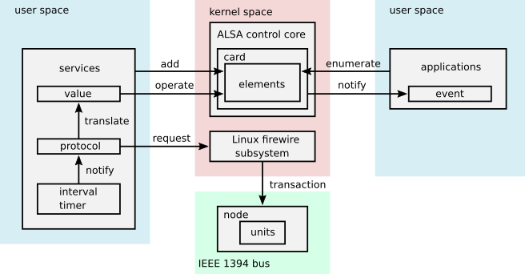
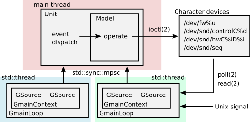

========================
snd-firewire-ctl-services
========================

2020/06/03
Takashi Sakamoto

Introduction
============

This project is a sub project in Advanced Linux Sound Architecture a.k.a ALSA,
to produce userspace service daemon for Audio and Music units on IEEE 1394 bus,
supported by drivers in ALSA firewire stack.

License
=======

GNU General Public License Version 3

Build dependencies
==================

* Rust programming language <https://www.rust-lang.org/>
* Cargo
* Some crates and their dependencies

  * glib crate in <https://gtk-rs.org/>

Runtime dependencies
====================

* glib <https://developer.gnome.org/glib/>

How to build
============

Build ::

    $ cargo build

Supported protocols
===================

* IEEE 1212:2001 - IEEE Standard for a Control and Status Registers (CSR) Architecture for Microcomputer Buses https://ieeexplore.ieee.org/servlet/opac?punumber=8030
* Protocols defined by 1394 Trading Association http://1394ta.org/specifications/
   * Configuration ROM for AV/C Devices 1.0 (Dec. 2000, 1394 Trade Association)

Design note
===========

Control model
-------------

Monitor model
-------------

Listener model (with help of drivers in ALSA firewire stack)
-------------------------------------------------------------------

.. image:: listener-model-a.png
   :alt: listener-a-model

Listener model (without any help of drivers in ALSA firewire stack)
-------------------------------------------------------------------

Multi threading
---------------

